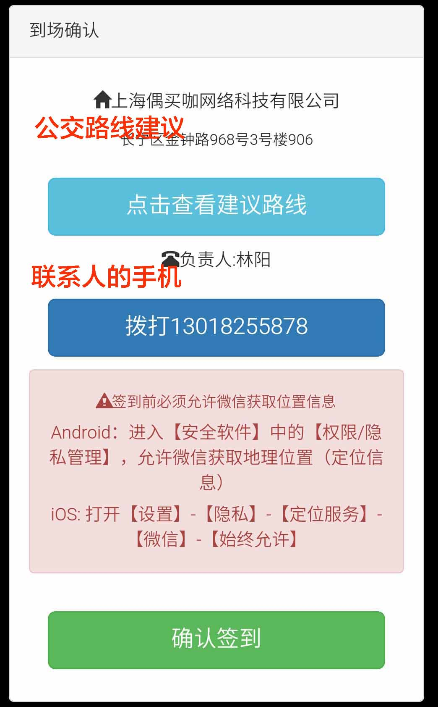
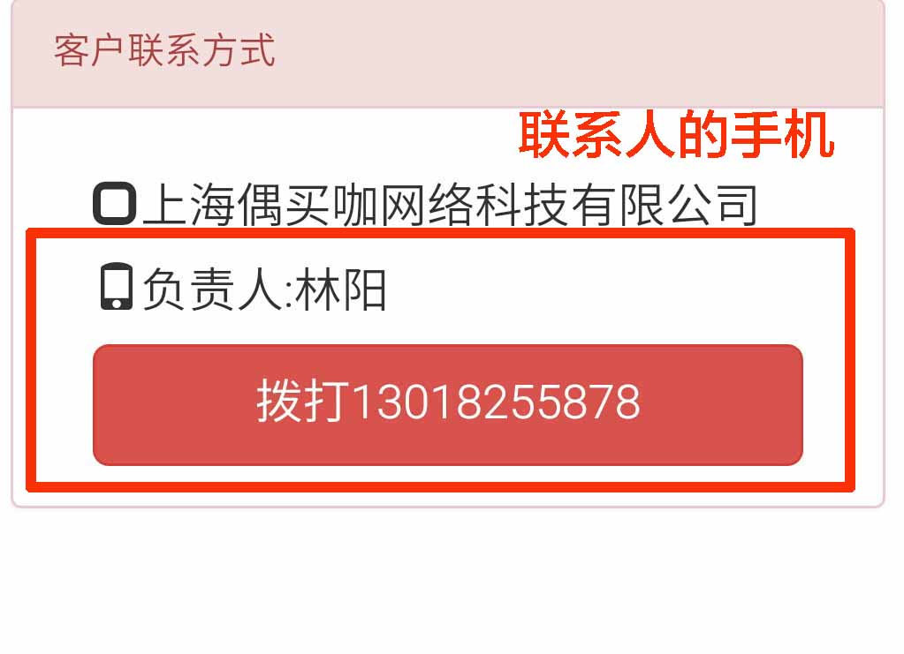

# 芒果IT公众号说明

## 文字描述

1. 扫描专属二维码
2. 用户注册（是工程师需要工程师注册）
3. **呼叫IT（呼叫本人自动回复、负责人收到呼叫提醒、后台收到报障提醒）**
4. 确认呼叫（呼叫本人和负责人收到确认通知）
5. **委派任务（负责人收到委派通知、工程师收到委派通知）**
6. **工程师提交派单（负责人收到确认通知、工程师收到待确认通知）**
7. **负责人确认派单（工程师收到完成通知，可以离场）**

## 注册

### 工程师流程

##### 第1步 工程师信息注册

##### 第2步 普通用户流程

### 用户流程

## 业务通知

### 呼叫IT

#### 呼叫本人（微信自动回复）

#### 客户公司负责人（用户申请事项提醒）

#### 后台人员（新增故障申报提醒）

### 确认呼叫

#### 呼叫本人（IT服务单受理通知）及 客户公司联系人

### 委派任务

#### 客户公司负责人（新派单提醒）

#### 被委派工程师（新派单提醒）

### 工程师提交OA系统派单后

#### 客户公司负责人（服务通知完成确认通知）

#### 工程师收到通知（派单待确认通知）

### 客户完成确认

#### 工程师收到通知（服务完成通知）

# 芒果IT公众号 - 商店说明

## 首页

## 商品页

## 推荐页

## 客户收到的推荐

## 下单成功后的订单页

